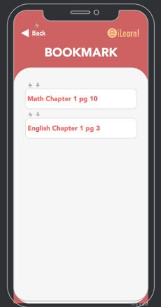
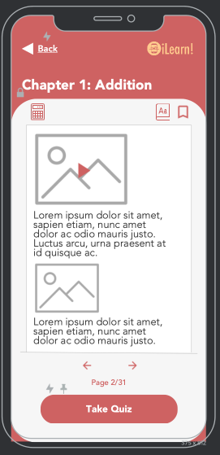
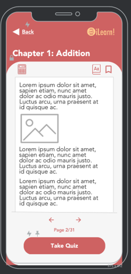
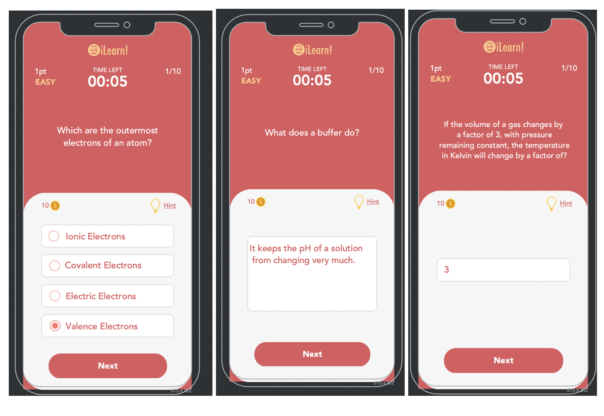
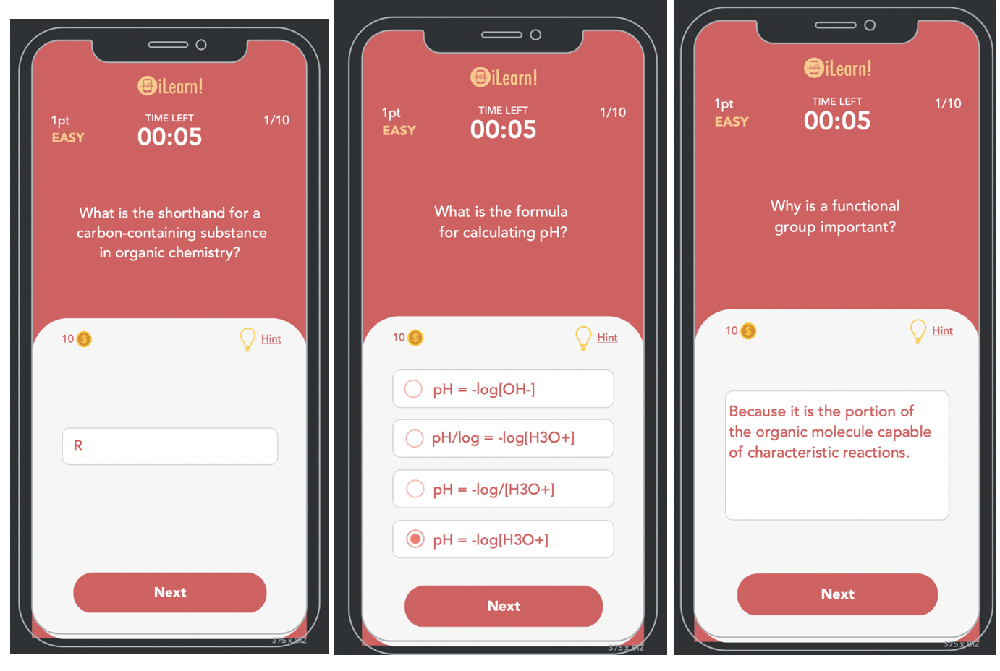
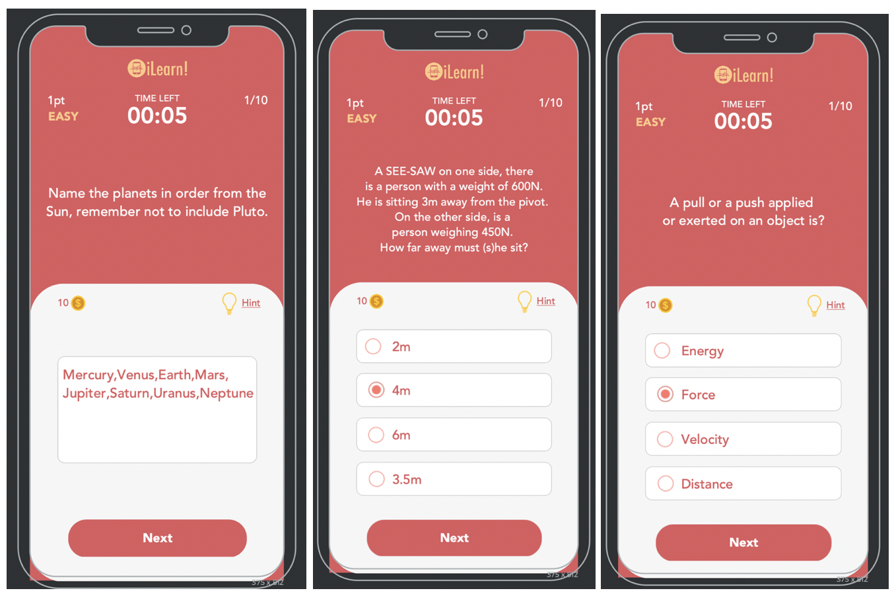
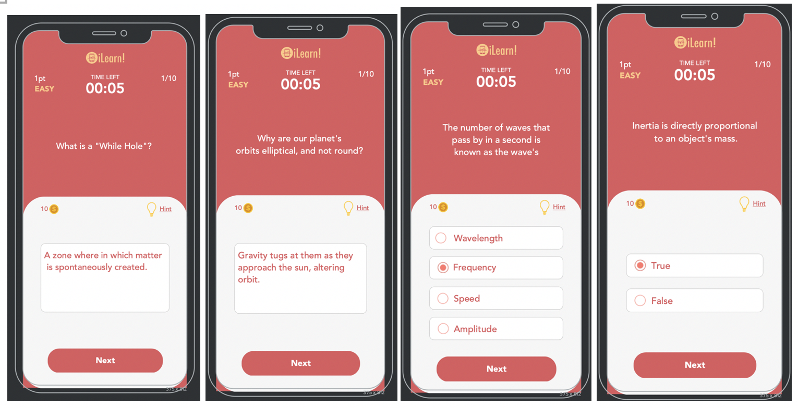
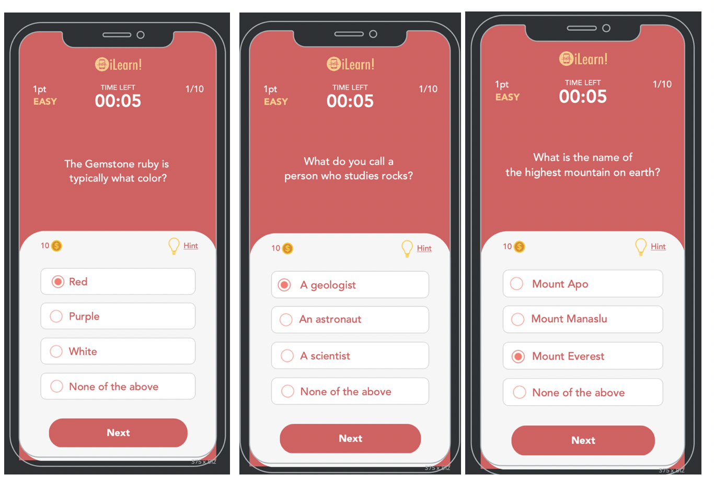
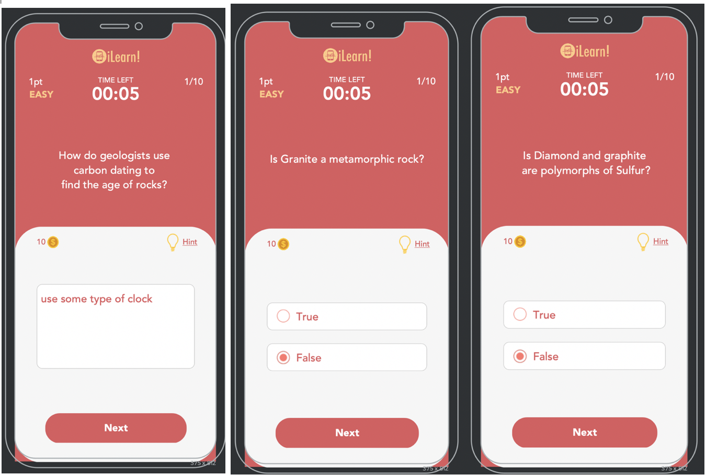
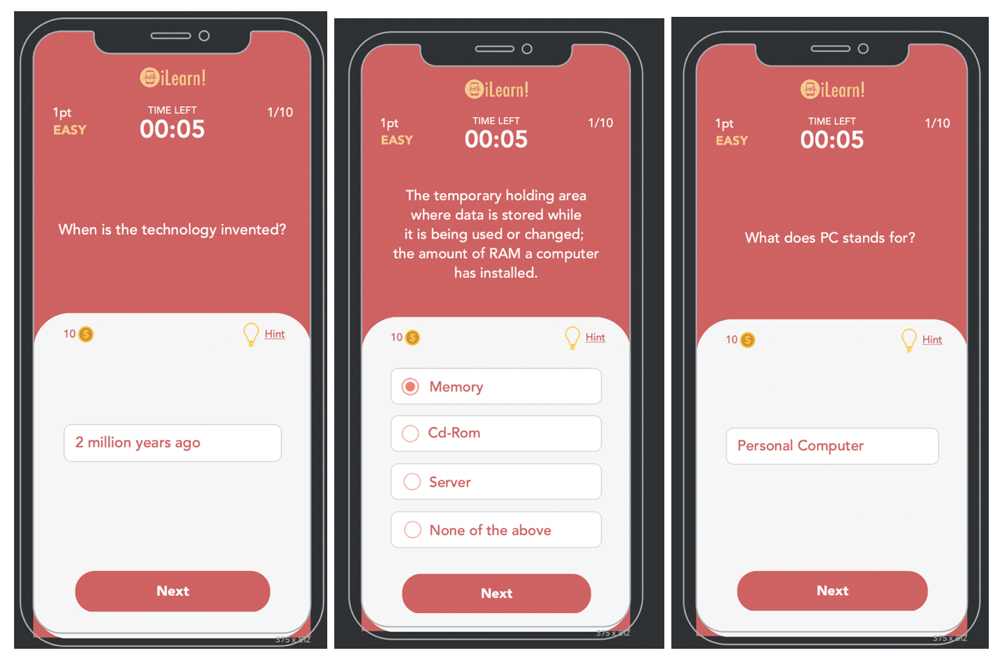

# Bloom's

###### Definition
> Created by psychologist Dr. Benjamin Bloom in 1956.To promote higher forms
> of thinking in education, such as analyzing and evaluating concepts, processes,
> procedures, and principles, rather than just remembering facts (rote learning).
> Educators usually used blooms to guide them in development assessments example
> test and other evaluation of student learning.

###### Features
1. Bookmark - the learner will be able to take notes and organize his/her ideas or
write comparison relating and elaborating it is useful for the learner when he
or she want to take notes in every lesson (Affective Domain: Organizing).

2. Having small quizzes at the end of each chapter or topic as evaluation.

3. Chapters and lessons the user can gain information and can recall this in the
quiz (Cognitive Domain: Knowledge).

4. Can either choose reading, watching video, or listening to a podcast about the
lesson or topic.

## Biology (Lalis)

## Chemistry (Magallen & Lagang)

## Physics (Catacutan)

## Earth Science (Marquez & Colomer)

## Technology (Palma)

